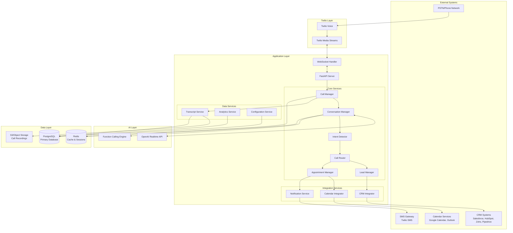

# Technical Design Document

## Overview

This document provides the technical design for an AI Voice Automation system for Small and Medium Enterprises (SMEs). The system builds upon an existing Twilio and OpenAI Realtime API integration to provide comprehensive call handling, intent detection, intelligent routing, CRM integration, and analytics capabilities.

### Business Context

SMEs currently lose 30-50% of inbound calls due to unavailability, resulting in ₹10,000-₹1L/month revenue leakage. This system addresses this critical gap by providing 24/7 AI-powered call handling that can answer calls, detect intent, qualify leads, schedule appointments, and integrate with existing CRM systems.

### Current System

The existing codebase provides:
- FastAPI-based web server with WebSocket support
- Twilio Media Streams integration for real-time audio
- OpenAI Realtime API integration for conversational AI
- Bidirectional audio streaming (Twilio ↔ OpenAI)
- Interruption handling with speech detection
- Session state management per call

### Design Goals

1. **Reliability**: 99.5% uptime with graceful degradation
2. **Scalability**: Support 50+ concurrent calls with auto-scaling to 200% capacity
3. **Performance**: <1s response latency for 95% of interactions
4. **Extensibility**: Modular architecture supporting multiple CRM integrations
5. **Security**: End-to-end encryption with RBAC for data access
6. **Maintainability**: Clear separation of concerns with well-defined interfaces

## Architecture

### High-Level Architecture



### Component Responsibilities

#### Call Manager
- Manages call lifecycle (answer, hold, transfer, hangup)
- Coordinates between Twilio and OpenAI connections
- Maintains call state and context
- Handles concurrent call sessions
- Implements fallback strategies on failures

#### Intent Detector
- Analyzes conversation content using OpenAI function calling
- Classifies caller intent with confidence scores
- Triggers intent-specific workflows
- Handles intent changes during conversation
- Requests clarification for low-confidence detections

#### Call Router
- Routes calls based on intent, business rules, and availability
- Manages priority routing for high-value leads
- Provides call context to human agents during transfers
- Implements business hours logic
- Handles queue management during high volume

#### Conversation Manager
- Orchestrates AI-driven conversations
- Manages conversation flow and context
- Retrieves and applies conversation history
- Handles multi-language detection and switching
- Implements interruption handling

#### Lead Manager
- Captures lead information during conversations
- Qualifies leads with scoring algorithm
- Triggers notifications for high-value leads
- Manages lead lifecycle states
- Validates and enriches lead data

#### Appointment Manager
- Retrieves available time slots from calendar systems
- Proposes and confirms appointments
- Creates calendar entries
- Sends confirmation notifications
- Handles appointment modifications and cancellations

#### CRM Integrator
- Synchronizes call records with CRM systems
- Creates and updates lead records
- Implements retry logic with exponential backoff
- Supports multiple CRM platforms via adapter pattern
- Handles authentication and rate limiting

#### Transcript Service
- Records call audio in real-time
- Generates text transcripts from conversations
- Stores recordings and transcripts with metadata
- Implements retention policies
- Masks sensitive information (PII, payment data)

#### Analytics Service
- Collects call metrics and performance data
- Generates reports and dashboards
- Tracks KPIs (call volume, conversion rates, intent distribution)
- Implements alerting for performance degradation
- Supports data export in multiple formats

#### Configuration Service
- Manages system configuration (business hours, routing rules, AI personality)
- Supports multi-tenant configuration
- Implements configuration versioning
- Applies configuration changes with minimal latency
- Validates configuration before applying

## Components and Interfaces

### Core Data Structures

```python
from dataclasses import dataclass, field
from typing import Optional, List, Dict, Any
from datetime import datetime
from enum import Enum

class CallStatus(Enum):
    INITIATED = "initiated"
    RINGING = "ringing"
    IN_PROGRESS = "in_progress"
    COMPLETED = "completed"
    FAILED = "failed"
    NO_ANSWER = "no_answer"

class Intent(Enum):
    SALES_INQUIRY = "sales_inquiry"
    SUPPORT_REQUEST = "support_request"
    APPOINTMENT_BOOKING = "appointment_booking"
    COMPLAINT = "complaint"
    GENERAL_INQUIRY = "general_inquiry"
    UNKNOWN = "unknown"

class Language(Enum):
    ENGLISH = "en"
    HINDI = "hi"
    TAMIL = "ta"
    TELUGU = "te"
    BENGALI = "bn"

@dataclass
class CallContext:
    """Complete context for a call session."""
    call_id: str
    caller_phone: str
    caller_name: Optional[str] = None
    language: Language = Language.ENGLISH
    intent: Optional[Intent] = None
    intent_confidence: float = 0.0
    conversation_history: List[Dict[str, Any]] = field(default_factory=list)
    lead_data: Optional[Dict[str, Any]] = None
    appointment_data: Optional[Dict[str, Any]] = None
    metadata: Dict[str, Any] = field(default_factory=dict)
    created_at: datetime = field(default_factory=datetime.utcnow)
    
@dataclass
class LeadData:
    """Lead information captured during conversation."""
    name: str
    phone: str
    email: Optional[str] = None
    inquiry_details: str = ""
    budget_indication: Optional[str] = None
    timeline: Optional[str] = None
    decision_authority: bool = False
    lead_score: int = 0  # 1-10
    source: str = "voice_call"
    
@dataclass
class AppointmentData:
    """Appointment booking information."""
    customer_name: str
    customer_phone: str
    customer_email: Optional[str] = None
    service_type: str
    appointment_datetime: datetime
    duration_minutes: int = 30
    notes: Optional[str] = None
    confirmation_sent: bool = False
```

### Intent Detection Interface

```python
from abc import ABC, abstractmethod
from typing import Tuple

class IntentDetectorInterface(ABC):
    """Interface for intent detection implementations."""
    
    @abstractmethod
    async def detect_intent(
        self,
        conversation_history: List[Dict[str, Any]],
        current_transcript: str
    ) -> Tuple[Intent, float]:
        """
        Detect caller intent from conversation.
        
        Args:
            conversation_history: Previous conversation turns
            current_transcript: Current conversation text
            
        Returns:
            Tuple of (detected_intent, confidence_score)
        """
        pass
    
    @abstractmethod
    async def request_clarification(
        self,
        current_intent: Intent,
        confidence: float
    ) -> str:
        """
        Generate clarification question for low-confidence intent.
        
        Args:
            current_intent: Currently detected intent
            confidence: Confidence score
            
        Returns:
            Clarification question text
        """
        pass
```

### Intent Detection Implementation

The intent detector uses OpenAI's function calling capability to classify conversations:

```python
class OpenAIIntentDetector(IntentDetectorInterface):
    """Intent detection using OpenAI function calling."""
    
    INTENT_DETECTION_FUNCTIONS = [
        {
            "name": "classify_intent",
            "description": "Classify the caller's intent based on conversation",
            "parameters": {
                "type": "object",
                "properties": {
                    "intent": {
                        "type": "string",
                        "enum": [
                            "sales_inquiry",
                            "support_request",
                            "appointment_booking",
                            "complaint",
                            "general_inquiry",
                            "unknown"
                        ],
                        "description": "The primary intent of the caller"
                    },
                    "confidence": {
                        "type": "number",
                        "minimum": 0.0,
                        "maximum": 1.0,
                        "description": "Confidence score for the classification"
                    },
                    "reasoning": {
                        "type": "string",
                        "description": "Brief explanation of why this intent was chosen"
                    }
                },
                "required": ["intent", "confidence"]
            }
        }
    ]
    
    async def detect_intent(
        self,
        conversation_history: List[Dict[str, Any]],
        current_transcript: str
    ) -> Tuple[Intent, float]:
        """Detect intent using OpenAI function calling."""
        # Implementation uses OpenAI Realtime API function calling
        # to analyze conversation and return structured intent data
        pass
```

### CRM Integration Interface

```python
class CRMIntegratorInterface(ABC):
    """Interface for CRM system integrations."""
    
    @abstractmethod
    async def create_call_record(
        self,
        call_context: CallContext,
        transcript: str,
        recording_url: str,
        duration_seconds: int
    ) -> str:
        """
        Create call record in CRM.
        
        Returns:
            CRM record ID
        """
        pass
    
    @abstractmethod
    async def create_lead(
        self,
        lead_data: LeadData,
        call_id: str
    ) -> str:
        """
        Create lead record in CRM.
        
        Returns:
            CRM lead ID
        """
        pass
    
    @abstractmethod
    async def update_contact(
        self,
        phone: str,
        updates: Dict[str, Any]
    ) -> bool:
        """Update existing contact in CRM."""
        pass
```

### CRM Adapter Pattern

```python
class CRMAdapterFactory:
    """Factory for creating CRM-specific adapters."""
    
    @staticmethod
    def create_adapter(crm_type: str, config: Dict[str, Any]) -> CRMIntegratorInterface:
        """Create appropriate CRM adapter based on type."""
        adapters = {
            "salesforce": SalesforceAdapter,
            "hubspot": HubSpotAdapter,
            "zoho": ZohoAdapter,
            "pipedrive": PipedriveAdapter
        }
        
        adapter_class = adapters.get(crm_type.lower())
        if not adapter_class:
            raise ValueError(f"Unsupported CRM type: {crm_type}")
        
        return adapter_class(config)

class SalesforceAdapter(CRMIntegratorInterface):
    """Salesforce-specific CRM integration."""
    
    def __init__(self, config: Dict[str, Any]):
        self.instance_url = config["instance_url"]
        self.access_token = config["access_token"]
        self.client = self._initialize_client()
    
    async def create_call_record(self, call_context, transcript, recording_url, duration_seconds):
        """Create Task record in Salesforce."""
        # Implementation using Salesforce REST API
        pass
    
    async def create_lead(self, lead_data, call_id):
        """Create Lead record in Salesforce."""
        # Implementation using Salesforce REST API
        pass
```

### Call Routing Decision Engine

```python
@dataclass
class RoutingRule:
    """Configuration for call routing logic."""
    intent: Intent
    priority: int  # Higher = more priority
    business_hours_only: bool
    agent_skills_required: List[str]
    max_queue_time_seconds: int
    
class CallRouter:
    """Intelligent call routing based on intent and business rules."""
    
    def __init__(self, config_service: ConfigService):
        self.config = config_service
        self.routing_rules: Dict[Intent, RoutingRule] = {}
        
    async def route_call(
        self,
        call_context: CallContext,
        agent_availability: Dict[str, bool]
    ) -> str:
        """
        Determine routing destination for call.
        
        Returns:
            Routing decision: "ai_continue", "transfer_to_agent", "voicemail"
        """
        if not call_context.intent:
            return "ai_continue"
        
        rule = self.routing_rules.get(call_context.intent)
        if not rule:
            return "ai_continue"
        
        # Check business hours
        if rule.business_hours_only and not self._is_business_hours():
            return "ai_continue"
        
        # Check agent availability
        available_agents = self._find_available_agents(
            agent_availability,
            rule.agent_skills_required
        )
        
        if available_agents:
            # High-value leads get priority routing
            if call_context.lead_data and call_context.lead_data.get("lead_score", 0) >= 7:
                return f"transfer_to_agent:{available_agents[0]}"
            return f"transfer_to_agent:{available_agents[0]}"
        
        return "ai_continue"
```

## Data Models

### Database Schema

The system uses PostgreSQL as the primary database with the following schema:

```sql
-- Calls table: stores all call records
CREATE TABLE calls (
    id UUID PRIMARY KEY DEFAULT gen_random_uuid(),
    call_sid VARCHAR(255) UNIQUE NOT NULL,
    caller_phone VARCHAR(20) NOT NULL,
    caller_name VARCHAR(255),
    direction VARCHAR(10) NOT NULL CHECK (direction IN ('inbound', 'outbound')),
    status VARCHAR(20) NOT NULL,
    language VARCHAR(5) DEFAULT 'en',
    intent VARCHAR(50),
    intent_confidence DECIMAL(3,2),
    started_at TIMESTAMP NOT NULL DEFAULT NOW(),
    ended_at TIMESTAMP,
    duration_seconds INTEGER,
    recording_url TEXT,
    transcript_url TEXT,
    metadata JSONB DEFAULT '{}',
    created_at TIMESTAMP NOT NULL DEFAULT NOW(),
    updated_at TIMESTAMP NOT NULL DEFAULT NOW()
);

CREATE INDEX idx_calls_caller_phone ON calls(caller_phone);
CREATE INDEX idx_calls_started_at ON calls(started_at);
CREATE INDEX idx_calls_intent ON calls(intent);
CREATE INDEX idx_calls_status ON calls(status);

-- Transcripts table: stores conversation transcripts
CREATE TABLE transcripts (
    id UUID PRIMARY KEY DEFAULT gen_random_uuid(),
    call_id UUID NOT NULL REFERENCES calls(id) ON DELETE CASCADE,
    speaker VARCHAR(20) NOT NULL CHECK (speaker IN ('caller', 'assistant', 'agent')),
    text TEXT NOT NULL,
    timestamp_ms INTEGER NOT NULL,
    language VARCHAR(5),
    confidence DECIMAL(3,2),
    created_at TIMESTAMP NOT NULL DEFAULT NOW()
);

CREATE INDEX idx_transcripts_call_id ON transcripts(call_id);
CREATE INDEX idx_transcripts_timestamp ON transcripts(timestamp_ms);

-- Leads table: stores captured lead information
CREATE TABLE leads (
    id UUID PRIMARY KEY DEFAULT gen_random_uuid(),
    call_id UUID REFERENCES calls(id) ON DELETE SET NULL,
    name VARCHAR(255) NOT NULL,
    phone VARCHAR(20) NOT NULL,
    email VARCHAR(255),
    inquiry_details TEXT,
    budget_indication VARCHAR(100),
    timeline VARCHAR(100),
    decision_authority BOOLEAN DEFAULT FALSE,
    lead_score INTEGER CHECK (lead_score BETWEEN 1 AND 10),
    source VARCHAR(50) DEFAULT 'voice_call',
    status VARCHAR(50) DEFAULT 'new',
    assigned_to VARCHAR(255),
    crm_id VARCHAR(255),
    crm_type VARCHAR(50),
    metadata JSONB DEFAULT '{}',
    created_at TIMESTAMP NOT NULL DEFAULT NOW(),
    updated_at TIMESTAMP NOT NULL DEFAULT NOW()
);

CREATE INDEX idx_leads_phone ON leads(phone);
CREATE INDEX idx_leads_email ON leads(email);
CREATE INDEX idx_leads_lead_score ON leads(lead_score);
CREATE INDEX idx_leads_status ON leads(status);
CREATE INDEX idx_leads_created_at ON leads(created_at);

-- Appointments table: stores scheduled appointments
CREATE TABLE appointments (
    id UUID PRIMARY KEY DEFAULT gen_random_uuid(),
    call_id UUID REFERENCES calls(id) ON DELETE SET NULL,
    lead_id UUID REFERENCES leads(id) ON DELETE SET NULL,
    customer_name VARCHAR(255) NOT NULL,
    customer_phone VARCHAR(20) NOT NULL,
    customer_email VARCHAR(255),
    service_type VARCHAR(255) NOT NULL,
    appointment_datetime TIMESTAMP NOT NULL,
    duration_minutes INTEGER DEFAULT 30,
    status VARCHAR(50) DEFAULT 'scheduled',
    notes TEXT,
    confirmation_sent BOOLEAN DEFAULT FALSE,
    calendar_event_id VARCHAR(255),
    calendar_provider VARCHAR(50),
    reminder_sent BOOLEAN DEFAULT FALSE,
    metadata JSONB DEFAULT '{}',
    created_at TIMESTAMP NOT NULL DEFAULT NOW(),
    updated_at TIMESTAMP NOT NULL DEFAULT NOW()
);

CREATE INDEX idx_appointments_customer_phone ON appointments(customer_phone);
CREATE INDEX idx_appointments_appointment_datetime ON appointments(appointment_datetime);
CREATE INDEX idx_appointments_status ON appointments(status);

-- Business configuration table
CREATE TABLE business_config (
    id UUID PRIMARY KEY DEFAULT gen_random_uuid(),
    business_id VARCHAR(255) UNIQUE NOT NULL,
    business_name VARCHAR(255) NOT NULL,
    greeting_message TEXT,
    ai_personality TEXT,
    business_hours JSONB NOT NULL DEFAULT '{}',
    holiday_schedule JSONB DEFAULT '[]',
    routing_rules JSONB DEFAULT '{}',
    crm_config JSONB DEFAULT '{}',
    notification_config JSONB DEFAULT '{}',
    language_config JSONB DEFAULT '{"default": "en", "supported": ["en", "hi"]}',
    knowledge_base TEXT,
    active BOOLEAN DEFAULT TRUE,
    created_at TIMESTAMP NOT NULL DEFAULT NOW(),
    updated_at TIMESTAMP NOT NULL DEFAULT NOW()
);

-- Call analytics aggregation table
CREATE TABLE call_analytics (
    id UUID PRIMARY KEY DEFAULT gen_random_uuid(),
    business_id VARCHAR(255) NOT NULL,
    date DATE NOT NULL,
    hour INTEGER CHECK (hour BETWEEN 0 AND 23),
    total_calls INTEGER DEFAULT 0,
    answered_calls INTEGER DEFAULT 0,
    missed_calls INTEGER DEFAULT 0,
    average_duration_seconds DECIMAL(10,2),
    intent_distribution JSONB DEFAULT '{}',
    language_distribution JSONB DEFAULT '{}',
    leads_captured INTEGER DEFAULT 0,
    appointments_booked INTEGER DEFAULT 0,
    high_value_leads INTEGER DEFAULT 0,
    created_at TIMESTAMP NOT NULL DEFAULT NOW(),
    updated_at TIMESTAMP NOT NULL DEFAULT NOW(),
    UNIQUE(business_id, date, hour)
);

CREATE INDEX idx_analytics_business_date ON call_analytics(business_id, date);

-- CRM sync status table
CREATE TABLE crm_sync_log (
    id UUID PRIMARY KEY DEFAULT gen_random_uuid(),
    call_id UUID REFERENCES calls(id) ON DELETE CASCADE,
    lead_id UUID REFERENCES leads(id) ON DELETE CASCADE,
    crm_type VARCHAR(50) NOT NULL,
    operation VARCHAR(50) NOT NULL,
    status VARCHAR(20) NOT NULL CHECK (status IN ('pending', 'success', 'failed')),
    attempt_count INTEGER DEFAULT 0,
    last_attempt_at TIMESTAMP,
    error_message TEXT,
    crm_record_id VARCHAR(255),
    created_at TIMESTAMP NOT NULL DEFAULT NOW(),
    updated_at TIMESTAMP NOT NULL DEFAULT NOW()
);

CREATE INDEX idx_crm_sync_status ON crm_sync_log(status);
CREATE INDEX idx_crm_sync_call_id ON crm_sync_log(call_id);
```

### Redis Data Structures

Redis is used for caching and session management:

```python
# Session state cache (TTL: 1 hour)
# Key: session:{call_sid}
# Value: JSON serialized SessionState
{
    "call_id": "uuid",
    "stream_sid": "twilio_stream_sid",
    "caller_phone": "+1234567890",
    "language": "en",
    "intent": "sales_inquiry",
    "intent_confidence": 0.85,
    "conversation_history": [...],
    "latest_media_timestamp": 12345,
    "last_assistant_item": "item_id"
}

# Caller history cache (TTL: 180 days)
# Key: caller:{phone_number}
# Value: JSON array of previous call IDs
["call_id_1", "call_id_2", "call_id_3"]

# Agent availability cache (TTL: 5 minutes)
# Key: agents:availability
# Value: Hash of agent_id -> availability status
{
    "agent_001": "available",
    "agent_002": "busy",
    "agent_003": "offline"
}

# Configuration cache (TTL: 5 minutes)
# Key: config:{business_id}
# Value: JSON serialized business configuration
{
    "business_hours": {...},
    "routing_rules": {...},
    "ai_personality": "..."
}
```

### Object Storage Structure

Call recordings stored in S3-compatible object storage:

```
s3://voice-automation-recordings/
├── {business_id}/
│   ├── {year}/
│   │   ├── {month}/
│   │   │   ├── {day}/
│   │   │   │   ├── {call_id}.wav
│   │   │   │   ├── {call_id}_transcript.json
```

